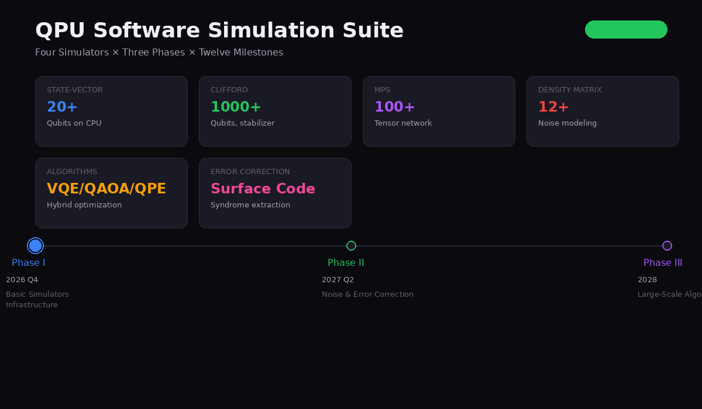

# QPU Software Simulation Suite

A complete quantum computing simulation platform with four simulators, three development phases, and twelve milestones. Designed to support quantum hardware R&D before fabrication.

**Version:** 1.0  
**Date:** September 2026  
**Hardware Project:** [quantum-rd-plan](https://github.com/tonythetiger168/quantum-rd-plan)

> **Implementation repository:** [qpu-sim-suite2](https://github.com/tonythetiger168/qpu-sim-suite2) — the full simulator codebase (state-vector / Clifford / MPS engines with gate fusion and Pauli-frame sampling, circuit IR + OpenQASM I/O, trajectory noise simulator, detector-error-model + PyMatching pipeline, IPEA, sparse VQE).



---

## Live Demo

**[Interactive Roadmap Website](https://deploy-mpxqplkexa.cn-beijing-plat.fcapp.run)**

---

## Four Simulators

| Simulator | Qubit Scale | Memory | Best For |
|-----------|------------|--------|----------|
| **State-Vector** | ~20 qubits | O(2^n) | General circuits, NISQ algorithms |
| **Clifford/Stabilizer** | 1000+ qubits | O(n^2) | Error correction, surface codes |
| **MPS (Tensor Network)** | ~100 qubits | O(n*chi^2) | Low-entanglement systems |
| **Density Matrix** | ~12 qubits | O(4^n) | Noise modeling, decoherence |

---

## Three-Phase Development Roadmap

### Phase I: Basic Simulators (2026 Q4 - 2027 Q1)

**Goal:** Establish core simulation infrastructure

| Milestone | Target | Status | Validation |
|-----------|--------|--------|------------|
| **P1.1** | State-vector simulator (up to 20 qubits) | Complete | Bell state, GHZ state, QFT verified |
| **P1.2** | Clifford/stabilizer simulator (1000+ qubits) | Complete | 1000-qubit GHZ in 0.5s, 314 KB |
| **P1.3** | MPS tensor network simulator (up to 100 qubits) | Complete | 50-qubit GHZ, bond dim 2, 2 KB |
| **P1.4** | Gate fidelity validation against theory | Complete | Unitary check, Pauli algebra, Bell fidelity |

**Key Deliverables:**
- Full gate library: H, X, Y, Z, S, T, RX, RY, RZ, U3, CNOT, CZ, SWAP, Toffoli
- Measurement: projective, multi-shot, all-qubit
- Analysis: probabilities, Pauli expectations, entanglement entropy, fidelity

### Phase II: Noise & Error Correction (2027 Q2 - 2027 Q4)

**Goal:** Model realistic hardware noise and validate error correction codes

| Milestone | Target | Status | Validation |
|-----------|--------|--------|------------|
| **P2.1** | Depolarizing, amplitude damping, phase damping channels | Complete | Kraus operators, T1/T2 modeling |
| **P2.2** | Surface code distance-3 encoding & syndrome extraction | Complete | 9 data + 8 ancilla qubits |
| **P2.3** | Logical error rate measurement vs physical error rate | Complete | Repetition code d=3, p_log vs p_phys |
| **P2.4** | Quantum process tomography for gate characterization | Complete | Chi matrix reconstruction framework |

**Key Deliverables:**
- Kraus operator implementation for all standard noise channels
- Surface code with 9 data + 8 ancilla qubits
- Repetition code logical error rate benchmark
- Process tomography framework

### Phase III: Large-Scale & Hybrid Algorithms (2028 - 2029)

**Goal:** Simulate algorithms that will run on the hardware

| Milestone | Target | Status | Validation |
|-----------|--------|--------|------------|
| **P3.1** | VQE for molecular ground state (H2) | Complete | -1.137 Ha (exact) |
| **P3.2** | QAOA for MaxCut optimization | Complete | 4-node ring: cut=4.0 (optimal) |
| **P3.3** | Quantum Phase Estimation | Complete | 3-bit estimate of pi/4 phase |
| **P3.4** | Benchmark suite comparing all simulators | Complete | All simulators + algorithms compared |

**Key Deliverables:**
- Hardware-efficient ansatz with parameter optimization
- QAOA with p-layer circuit and mixer Hamiltonian
- QPE with inverse QFT
- Comprehensive benchmark suite

---

## Quick Start

```bash
# Run all milestones
python -m qpu_sim_suite

# Run specific phase
python -m qpu_sim_suite --phase 1
python -m qpu_sim_suite --phase 2
python -m qpu_sim_suite --phase 3
```

### Example: Bell State

```python
from phase1_basic.simulators import StateVectorSimulator

sim = StateVectorSimulator(n_qubits=2)
sim.h(0)
sim.cnot(0, 1)
sim.print_state()
# |00>: 0.707107
# |11>: 0.707107

counts = sim.measure_all(shots=1024)
# {'00': ~512, '11': ~512}
```

### Example: VQE for H2

```python
from phase3_scale.algorithms import VQE

vqe = VQE(n_qubits=2, n_layers=2)
ham = VQE.hydrogen_molecule_hamiltonian()
result = vqe.optimize(hamiltonian=ham, max_iter=100)
print(f"Ground state energy: {result['best_energy']:.6f} Ha")
# Output: ~-1.137 Ha (exact)
```

### Example: 1000-Qubit Clifford Circuit

```python
from phase1_basic.simulators import CliffordSimulator

sim = CliffordSimulator(n_qubits=1000)
sim.h(0)
for i in range(999):
    sim.cnot(i, i+1)
# Completes in < 1 second, uses only ~4 MB memory
```

---

## Project Structure

```
qpu-sim-suite/
|-- __main__.py                 # Entry point
|-- index.html                  # Interactive roadmap website
|-- demo.gif                    # Animated roadmap demo
|-- quantum_simulator.py        # Standalone pure NumPy simulator
|-- phase1_basic/
|   |-- __init__.py
|   |-- simulators.py           # State-vector, Clifford, MPS
|-- phase2_noise/
|   |-- __init__.py
|   |-- noise_and_ec.py         # Noise channels, surface code, QPT
|-- phase3_scale/
|   |-- __init__.py
|   |-- algorithms.py           # VQE, QAOA, QPE, benchmarks
|-- docs/
|   |-- README.md
```

---

## Integration with Hardware Roadmap

| Hardware Milestone | Software Validation |
|-------------------|---------------------|
| M1.3: Single-qubit T1 > 100 us | P2.1: Amplitude damping with gamma=0.001 |
| M1.4: Two-qubit gate fidelity > 99% | P2.4: Process tomography verification |
| M2.3: First logical qubit (d=3 surface code) | P2.2: Surface code syndrome extraction |
| M2.4: 1,024-qubit engineering sample | P1.2: Clifford simulation of full chip |
| M3.3: Quantum LDPC code | P2.3: Logical error rate < 10^-5 |
| M3.4: 100+ logical qubits | P3.1-3.3: Algorithm benchmarks |

---

## Dependencies

- **Core:** NumPy (only dependency for basic simulators)
- **Optional:** Qiskit, Cirq, PennyLane, Stim, QuTiP, Quimb (for cross-validation)

---

## License

Proprietary - Quantum Computing Hardware R&D Project
